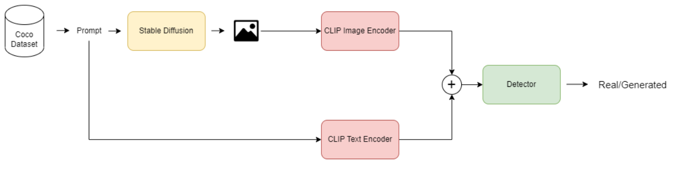

# Detecting Images generated by Diffusers

Code for paper available on [Arxiv](https://arxiv.org/abs/2303.05275)

This paper explores the task of detecting images generated by text-to-image diffusion models. To evaluate this, we consider images generated from captions in the MSCOCO and Wikimedia datasets using two state-of-the-art models: Stable Diffusion and GLIDE. Our experiments show that it is possible to detect the generated images using simple Multi-Layer Perceptrons (MLPs), starting from features extracted by CLIP, or traditional Convolutional Neural Networks (CNNs). We also observe that models trained on images generated by Stable Diffusion can detect images generated by GLIDE relatively well, however, the reverse is not true. Lastly, we find that incorporating the associated textual information with the images rarely leads to significant improvement in detection results but that the type of subject depicted in the image can have a significant impact on performance. This work provides insights into the feasibility of detecting generated images, and has implications for security and privacy concerns in real-world applications. 

# Preprocessing

To train and test a new model it is necessary to generate one synthetic image for each prompt available in the two considered datasets.
- MSCOCO: https://cocodataset.org/
- Wikipedia Dataset: https://www.kaggle.com/c/wikipedia-image-caption

Run the following command to start the generation:
'''
python3 generate_images.py
'''

You can customize it with the following parameters:
- --workers: Number of workers (Default: 100)
- --n_samples: Number of fake images generated for each prompt (default: 4)
- --considered_images: Number of pristine images (and prompts) to be considered from the dataset (default: 6000)
- --dataset: Which dataset to be used for the generation (0: COCO, 1: Wikipedia) (default: 0)
- --list_file: Path to the json containing the list of images (default: "../datasets/coco/annotations/captions_val2014.json")
- --copy_files: If used, the process will also copy the pristine image associated with the caption, it is due for the first running (default: False)
- --force_captions: Consider only the captions contained in a specific folder (the name of the folders)
- --excluded_images: Exclude images/captions contained in the paths indicated
- --output_path: Path in which the images should be saved

This should be run for each dataset and for each part of the dataset (train/val/test). The output folders will look like:

- datasets
  - train
      - Prompt 0
        - Fake Image 0
        - ...
        - ...
        - Fake Image N
        - Pristine Image
       
      - ...
      - ...
      - Prompt N
        - ...
  - val
      - Prompt 0
        - Fake Image 0
        - ...
        - ...
        - Fake Image N
        - Pristine Image
       
      - ...
      - ...
      - Prompt N
        - ...
  - test 
      - Prompt 0
        - Fake Image 0
        - ...
        - ...
        - Fake Image N
        - Pristine Image
       
      - ...
      - ...
      - Prompt N
        - ...
  

# Training

To train a model on the prepared dataset run the following command:
'''
python3 train.py --config path/to/config
'''

You can customize it with the following parameters:
- --num_epochs: Number of epochs for training (default: 30)
- --workers: Number of workers (default: 100)
- --training_path: Path to the training images constructed as in the preprocessing
- --validation_path: Path to the validation images constructed as in the preprocessing
- --resume: Path to the weights from which restart the training
- --model_name: Name of the model to be saved (default: "model")
- --model_path: Path in which to save the models
- --gpu_id: ID of GPU to be used
- --config: Path to the configuration file contained in the config folder
- --model: Which model to be trained between those available
- --clip_mode: Which CLIP version should be used and which features should be used in the case of text+image setup (Resnet50 or ViT Features)
- --mode: If training should be conducted in Image-Only or Image+Text setup
- --patience: Number of epochs should be waited before stopping for validation loss not improving (default: 5)
- --use_pretrained: Automatically load pretrained model when available (default: True)
- --show_stats: Allow additional stats prints (default: True)
- --logger_name: Path in which save logs

# Inference

To test a model on the prepared dataset run the following command:
'''
python3 test.py --config path/to/config --model_weights path/to/model/weights
'''

You can customize it with the following parameters:
- --workers: Number of workers (default: 100)
- --test_path: Path containing the test images constructed as in preprocessing
- --model_weights: Path to the weights of the trained model to be tested
- --model_name: Name of the model for saving statistics (default: Model)
- --display_pre: Print some text before the statistics (default: "")
- --display_post: Print some text after the statistics (default: "")
- --gpu_id: Id of GPU to be used
- --config: Path to the configuration file contained in the config folder
- --model: Model to be tested
- --clip_mode: Which CLIP version should be used and which features should be used in the case of text+image setup (Resnet50 or ViT Features)
- --mode: If the test should be conducted in Image-Only or Image+Text setup
- --show_stats: Allow additional stats prints (default: False)
- --analyze_tags: (Available only on Wikipedia dataset) Use tags.txt file for error analysis as in the paper (default: False)
